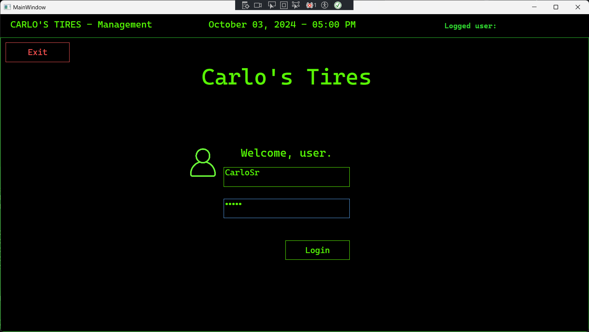
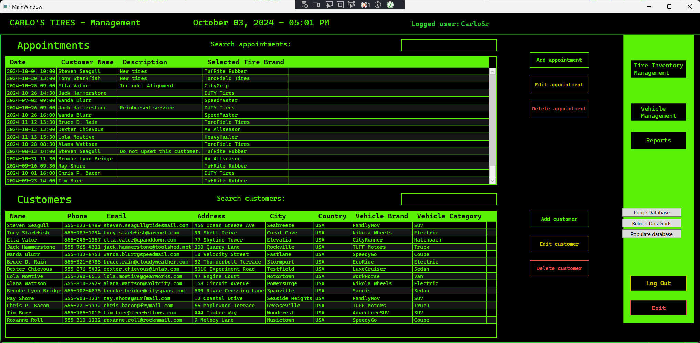
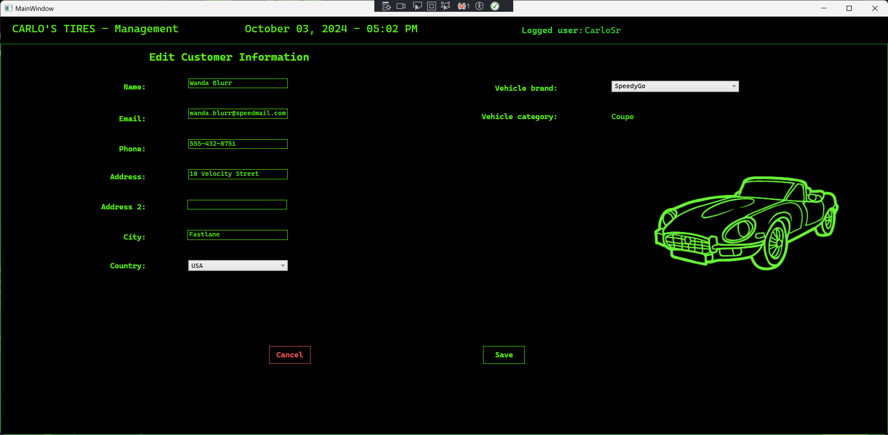
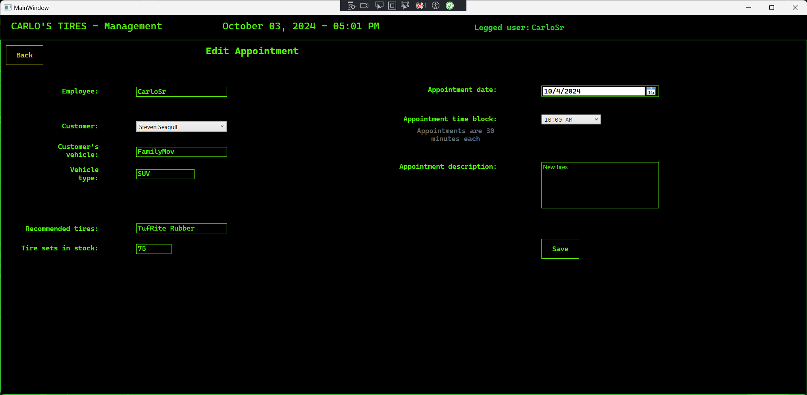
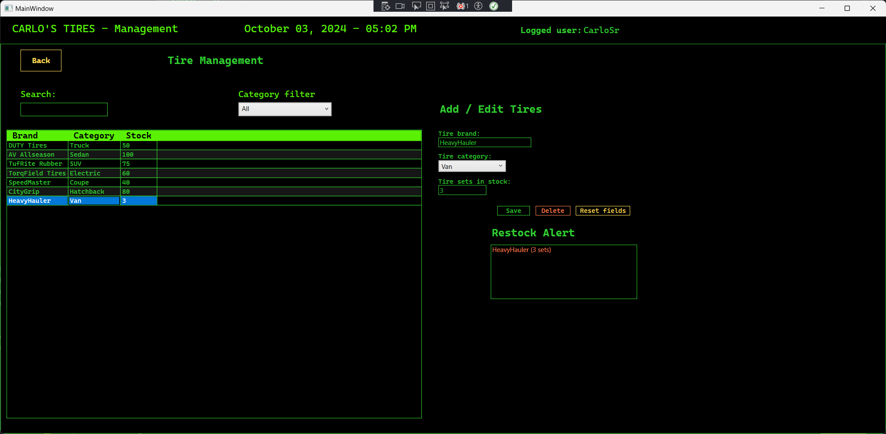
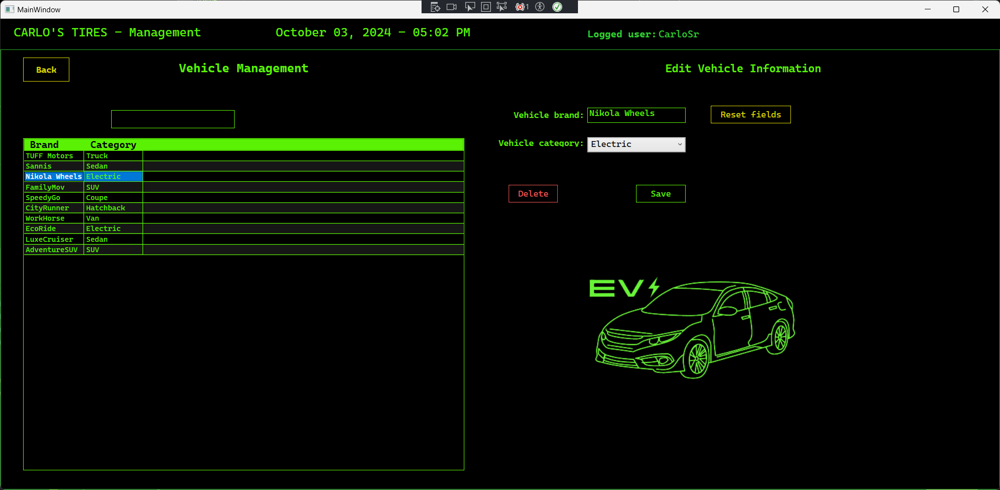
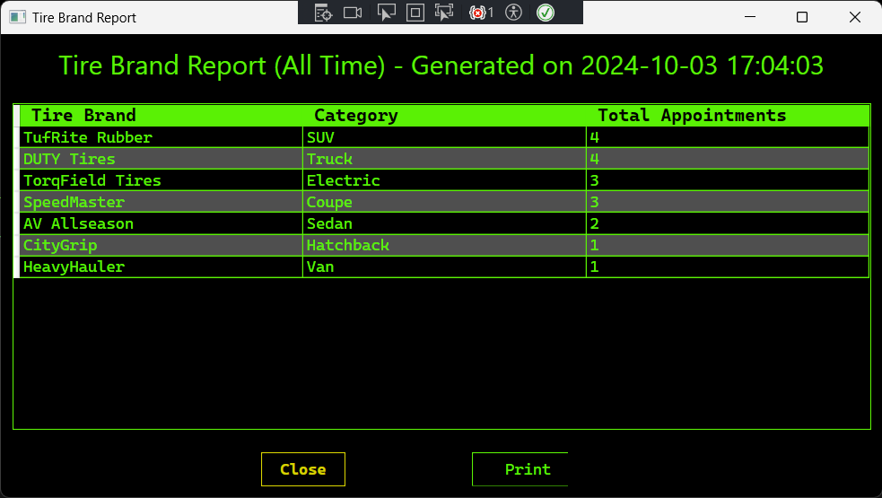

# Carlo's Tire - Schedule Management App


## Table of Contents
1. [Overview](#overview)
2. [Features](#features)
3. [Installation](#installation)
4. [Usage](#usage)
5. [Screenshots](#screenshots)
6. [Video Demo](#video-demo)
7. [Contributing](#contributing)
8. [License](#license)
9. [Contact](#contact)

## Overview
Carlo's Tire is a schedule management application designed for a fictional tire shop. This application manages customer records, schedules appointments, generates reports, and maintains an activity log. Built as part of the C868 capstone project, it is a comprehensive scheduling solution for small businesses. 
The data in this app is stored within a SQLite database to promote app independence from a central database or complicated solutions involving MySQL or the like.

## Features
- **Customer Management**: Add, edit, and delete customer records.
- **Appointment Scheduling**: Schedule and manage appointments with adjustable time slots.
- **Reports**: Generate reports based on appointment history and customer data.
- **Exception Handling**: Robust error handling to ensure smooth operation.
- **Activity Log**: Keep track of user activity and system events.

## Installation

1. Clone the repository:
   ```bash
   git clone https://github.com/yourusername/carlos-tire-schedule-app.git
   ```
2. Open the project in Visual Studio 2022.
3. Build and run the application first.

## Usage

1. Login using your credentials.
2. Manage customer records by navigating to the 'Customers' tab.
3. Use the 'Appointments' tab to schedule new appointments and manage existing ones.
4. Adjust for different time zones and view reports via the 'Reports' section.

## Screenshots

**User login**


**The main dashboard**



**Adding or editing customers to the database**



**Adding or editing appointments**


**Tire management**


**Vehicle management**


**Report generation page**

**Report pop-up window**



---

## Video Demo

Here’s a demo video showcasing the Vehicle Management feature:

[<iframe width="560" height="315" src="https://www.youtube.com/embed/8OyW-fVfc0s" frameborder="0" allowfullscreen></iframe>
](https://youtu.be/8OyW-fVfc0s)
---
## Contributing
If you'd like to contribute to this project, feel free to submit a pull request or open an issue.

## License
This project is licensed under the MIT License - see the [LICENSE](LICENSE) file for details.

**Note:** This project was created as part of my university capstone, and while it's open-source, it is intended for learning and educational purposes. Please provide attribution if you use or modify it, and consider giving back to the community!

> [!NOTE]
> My purpose for sharing my project here is not to promote copying and reusing as current passing projects, but rather to use as their personal projects to experiment with for learning purposes, and perhaps to even improve upon!
> I know my code is ugly...

## Contact
For any questions, feel free to reach out to me at deafbits@gmail.com

